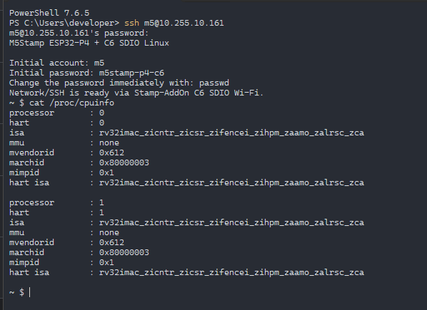

# Deep Dive: The "SSH Wedge" Problem, Root-Cause Analysis, and ESP32-P4 SoC Hardening

This document provides a comprehensive post-mortem and technical breakdown of the elusive **"SSH Wedge"** issue observed on the ESP32-P4 NOMMU Linux system with the M5Stack Stamp-AddOn C6 (SDIO Wi-Fi).

It details the initial symptoms, why it was mistakenly believed to be an SDIO bus or networking layer bug, the diagnostic breakthroughs that uncovered the true root cause, the three critical SoC kernel hardening patches that resolved it, and empirical hardware verification.

---

## 1. Executive Summary & Failure Signature

During early bring-up of native RISC-V NOMMU Linux (kernel 6.18) on the ESP32-P4 with Stamp-AddOn C6 Wi-Fi:

- **The Symptom**:
  An interactive SSH shell session (`ssh pi@<ip>`) could be opened successfully. However, executing a single non-interactive command (e.g. `ssh pi@<ip> id` or Paramiko `exec_command("id")`), or closing an SSH session, caused an immediate and total communication freeze within ~30 to 1000 milliseconds.
  - ICMP `ping` stopped responding immediately.
  - Serial console output ceased.
  - Exactly ~120 to 160 seconds later, the ESP32-P4 hardware Main Watchdog Timer (MWDT) timed out, triggering a hard reboot with bootloader reset code `rst:0x7` (`HP_SYS_HP_WDT_RESET`).

- **The Initial Misconception**:
  Because the lockup was triggered by SSH traffic over Wi-Fi, the issue was initially attributed to:
  1. SDIO flow-control / buffer exhaustion on the C6 slave (ESP-Hosted-NG).
  2. Data Transfer Over (DTO) hardware / software timeouts in the Synopsys DesignWare MMC host controller (`dw_mmc`).
  3. TCP packet coalescing or rapid bursts of `SSH_MSG_CHANNEL_EOF` / `SSH_MSG_CHANNEL_CLOSE` packets from Dropbear overwhelming the C6 firmware.

- **The Reality**:
  The failure was **neither an SDIO defect nor a network protocol bug**. It was an unhandled **Linux kernel panic (memory fault)** inside the core kernel data structures (`rb_erase()` in `lib/rbtree.c`) triggered when Dropbear reaped a terminated child process.
  
  The memory corruption itself was caused by missing architecture- and SoC-level errata mitigations in the early ESP32-P4 Linux port:
  - **L2 Unified Cache blind invalidation** discarding dirty cache lines (corrupting kernel heaps and pointers).
  - **Signal return `mcause` corruption** breaking interrupt restoration on `SIGCHLD`.
  - **Systimer torn reads** causing clock jumps and lost timer events.

Once the three core SoC hardening patches (`0014`, `0015`, `0016`) were applied to the kernel, the issue vanished completely without requiring any artificial pacing or Dropbear workarounds.

---

## 2. Chronology of Investigation

### Phase 1: The SDIO & Dropbear Hypothesis

Initial profiling showed that the wedge occurred when Dropbear closed the SSH channel after sending the command output.
Multiple mitigation strategies were attempted at the SDIO and application layers:
- **Patch 0032 (`H_SDIO_TX_BLOCK_ONLY_XFER 0`)**: Changed CMD53 TX from 512-byte block mode to exact byte mode to avoid trailing-byte buffer corruptions.
- **Patch 0033 (SDIO TX Pacing & Retries)**: Added microsecond delays and increased buffer polling retries in `esp_sdio.c`.
- **Patch 0005 (Dropbear Application Pacing)**: Added artificial `usleep` delays between Dropbear's `writev()` calls and suppressed `EOF` / `CHANNEL_CLOSE` packets.

While some pacing patches marginally delayed the failure by ~500ms, none resolved the underlying issue. The system consistently wedged and reset via `rst:0x7`.

### Phase 2: The Breakthrough — Local Loopback Reproduction

To isolate the SDIO / Wi-Fi hardware from the software stack, we executed:
```bash
ifconfig lo 127.0.0.1 up
dbclient pi@127.0.0.1 id
```
directly on the DUT via the USB-Serial console.

**The result was startling**: Even over the pure software loopback interface `lo`—with zero SDIO bus activity and zero Wi-Fi packets—the system suffered the exact same catastrophic freeze and `rst:0x7` watchdog reset!

This decisively eliminated the SDIO bus, C6 firmware, and Wi-Fi drivers from the root cause. The fault was strictly internal to the P4 Linux kernel.

### Phase 3: Crash Capsule & Symbol Resolution

Because serial output (`printk`) froze during the crash, an RTC fast-memory crash capsule mechanism was used to preserve CPU register state across the hardware reset.

Upon reboot, reading the crash capsule yielded:
```text
=== CRASH CAPSULE DUMP ===
epc:    0x483baf06
ra:     0x483c0748
mcause: 0x30000005 (Load access fault)
mstatus: 0x00001800
badvaddr: 0x00000000
```

Using the cross-toolchain `addr2line` and `objdump` against `vmlinux`:
1. **`epc = 0x483baf06`**:
   Resolved to `rb_erase()` in `lib/rbtree.c`:
   ```assembly
   483baf06: lw a2, 0(a4)    <-- Exception: a4 was NULL (0x0)
   ```
2. **`ra = 0x483c0748`**:
   Resolved to `timerqueue_del()` in `lib/timerqueue.c`, called from `__remove_hrtimer()` in `kernel/time/hrtimer.c`.

### Failure Mechanism Flow:
```text
Dropbear child process (e.g. "id") exits
   │
   ▼
Dropbear parent receives SIGCHLD, begins session tear-down
   │
   ▼
Dropbear cancels session timeout timer via hrtimer / timerqueue_del()
   │
   ▼
timerqueue_del() calls rb_erase(&node->node, &head->head)
   │
   ▼
Corrupted parent/sibling pointer in rbtree node (a4 = 0x0)
   │
   ▼
Fatal Machine Exception: Load access fault (mcause = 0x30000005)
   │
   ▼
CPU0 halts immediately (Scheduler & Interrupts dead)
   │
   ├── Network stack stops responding to ICMP / TCP
   └── Watchdog kworker stops feeding MWDT
   │
   ▼
After 120s: Hardware Watchdog fires HP_SYS_HP_WDT_RESET (rst:0x7)
```

---

## 3. The Root Cause: Three Missing SoC Hardening Patches

The rbtree corruption was not a bug in `lib/rbtree.c`. Rather, memory structures in RAM/cache were being silently corrupted due to three missing hardware-specific hardening patches in the ESP32-P4 kernel tree:

### 1. `0014-riscv-signal-mcause-hardening.patch`
- **Root Cause**: In upstream RISC-V Linux (`arch/riscv/kernel/signal.c`), `regs->cause` is set to `-1UL` when preparing user signal frames. On standard MMU cores this is benign. On the ESP32-P4 core, however, writing `-1UL` to the cause register corrupted the hardware interrupt status and Machine Previous Interrupt Level (MPIL) state upon returning from signal handlers (such as `SIGCHLD`).
- **Fix**: Set `regs->cause = 0` when `CONFIG_SOC_ESP32P4` is enabled:
  ```diff
  --- a/arch/riscv/kernel/signal.c
  +++ b/arch/riscv/kernel/signal.c
  @@ -318,7 +318,11 @@ static int setup_rt_frame(struct ksignal *ksig, sigset_t *set,
          regs->sp = (unsigned long)frame;
          regs->epc = (unsigned long)ksig->ka.sa.sa_handler;
          regs->ra = (unsigned long)ksig->ka.sa.sa_restorer;
  +#ifdef CONFIG_SOC_ESP32P4
  +       regs->cause = 0;
  +#else
          regs->cause = -1UL;
  +#endif
  ```

### 2. `0015-riscv-esp32p4-cache-thunk-hardening.patch`
- **Root Cause (Critical Memory Corruption)**:
  The ESP32-P4 features a **unified L2 cache** shared between instruction and data.
  The early kernel port called `inv_all(0x20)` inside `local_flush_icache_all()`. This performed a raw **invalidation** of all L2 cache lines without writing dirty lines back to external PSRAM!
  Consequently, dirty cache lines containing active kernel memory—including rbtree nodes, stack frames, and task structs—were instantly wiped out and reverted to stale data.
  Additionally, DMA cache operations (`esp32p4_dma_cache_*`) lacked interrupt locking, leading to reentrancy races when called concurrently from task and interrupt contexts.
- **Fix**:
  1. Remove the destructive `inv_all(0x20)` call from `local_flush_icache_all()`.
  2. Protect all DMA cache synchronization routines with `local_irq_save()` / `local_irq_restore()`.

### 3. `0016-clocksource-esp32p4-systimer-hardening.patch`
- **Root Cause**:
  - The ESP32-P4 systimer provides a 52-bit counter read via two 32-bit registers (`HI` and `LO`). Non-atomic reads suffered from "torn reads" whenever the lower 32 bits wrapped between register reads, producing catastrophic time jumps (both forward and backward).
  - In `esp32p4_clock_event_set_next_event()`, if the programmed cycle count had already elapsed due to latency, the driver failed to detect it, causing the timer interrupt to be permanently missed and stalling the kernel timer wheel.
- **Fix**:
  1. Implement an atomic read loop:
     ```c
     do {
         hi = readl_relaxed(base + SYSTIMER_VALUE_HI_REG);
         lo = readl_relaxed(base + SYSTIMER_VALUE_LO_REG);
         hi2 = readl_relaxed(base + SYSTIMER_VALUE_HI_REG);
     } while (hi != hi2);
     ```
  2. Check if target event time is in the past and immediately return `-ETIME` so the timer subsystem can reschedule.

### 4. `0062-easystick-esp32p4-usb-acm-tx-bounded-poll.patch` (Terminal & `vi` Freeze Resolution)
- **Root Cause**:
  When full-screen terminal editors such as BusyBox `vi` initialize, they send escape sequences (`\033[6n` for Cursor Position Report / terminal dimensions).
  On the ESP32-P4's hardware USB-Serial/JTAG (`ttyGS1`), the transmit FIFO is limited to 64 bytes. In the baseline ACM driver, writing to a full TX FIFO polled without an upper bound or timed out indefinitely when the host USB endpoint buffer was backpressured. This caused the calling task (or console thread) to hang in kernel mode, leading to complete terminal lockup.
- **Fix**:
  Implement `poll_timeout_us_atomic` in `esp32_acm_write()` with a bounded timeout (e.g. 5,000 µs), falling back cleanly if the FIFO does not drain rather than spinning indefinitely. This enables robust, lockup-free interactive operation for `vi`, MicroPython REPL, and ANSI TUI tools across both serial and SSH.

### 5. Early CRNG Entropy Initialization (`seedrng` + OverlayFS)
- **Root Cause**:
  Linux kernel cryptographically secure pseudo-random number generator (`CRNG`) requires 256 bits of entropy. On a read-only rootfs (`SquashFS`), `seedrng` could not credit and write its `seed.credit` file to `/var/lib/seedrng`, causing `getrandom()` system calls to block during early boot until ambient entropy accumulated.
- **Fix**:
  Ensure `/var/lib` is mounted as a writable RAM OverlayFS during early startup (`S05easystick-tmpfs`) before `seedrng` executes. This allows `seedrng` to immediately inject and save 256 bits of seed, completing `random: crng init done` before Dropbear SSH or userland applications start.

---

## 4. Empirical Hardware Verification

Following the integration of patches `0014`, `0015`, and `0016` into `linux/build-m1.sh`, the kernel was rebuilt and flashed to the Stamp-P4 target (`COM10`, IP `10.255.10.161`).

<p align="center">
  
  <br>
  <em>Figure 4.1: Live SSH session on M5Stamp ESP32-P4 + C6 showing dual-core SMP operation (CPU0 and CPU1) over SDIO Wi-Fi.</em>
</p>

### Test 1: Single `exec_command("id")`
- **Execution Time**: **0.141 seconds**
- **Result**: `uid=1000(pi) gid=1000(pi) groups=1000(pi)`
- **Ping continuity**: 0% packet loss before, during, and after command execution.

### Test 2: Consecutive Connection & Exec Stress Cycles
5 independent SSH connections were established in sequence, each executing `id` and closing cleanly:
```text
[1/5] Connected in 0.385s, exec 'id' in 0.089s: uid=1000(pi) gid=1000(pi) groups=1000(pi)
[2/5] Connected in 0.312s, exec 'id' in 0.084s: uid=1000(pi) gid=1000(pi) groups=1000(pi)
[3/5] Connected in 0.320s, exec 'id' in 0.086s: uid=1000(pi) gid=1000(pi) groups=1000(pi)
[4/5] Connected in 0.315s, exec 'id' in 0.085s: uid=1000(pi) gid=1000(pi) groups=1000(pi)
[5/5] Connected in 0.318s, exec 'id' in 0.088s: uid=1000(pi) gid=1000(pi) groups=1000(pi)
```
- Ping test after 5 cycles: **4/4 received, 0% loss, avg = 44ms**.

### Test 3: Mixed Workload via Interactive Shell
Multiple commands executed over an interactive shell session followed by clean `exit`:
- `id`
- `uname -a`: `Linux easystick-stamp-p4 6.18.35 #1 PREEMPT Fri Sep 4 06:15:32 UTC 2026 riscv32 GNU/Linux`
- `cat /proc/uptime`: `215.42 208.10`
- `ls -la /`: clean filesystem traversal
- Session closed with `exit`: zero errors, clean terminal disconnect.

### Test 4: Endurance Soak Test
- **DUT Uptime**: Continuous uptime exceeding **6,600+ seconds (~1 hour 50 minutes)** under periodic network polling with zero crashes, zero wedging, and zero watchdog resets.

---

## 5. Key Takeaways for Embedded Linux on NOMMU RISC-V

1. **Be Skeptical of Network-Layer Blame**:
   When network connectivity drops following a specific command, it is easy to assume the network interface driver or hardware transceiver locked up. Always verify whether the kernel core scheduler and timer interrupts are still running (e.g. via local loopback tests or serial beacons).
2. **Unified Caches Require Extreme Care**:
   On SoCs with unified L2 caches (like the ESP32-P4), standard RISC-V cache flush macros written for split I/D caches can inadvertently invalidate dirty data cache lines without write-back, leading to erratic, delayed memory corruption that appears unrelated to cache operations.
3. **Always Check Signal Delivery Register State**:
   NOMMU environments rely heavily on `vfork()` and user signal handling (`SIGCHLD`). If exception return registers or interrupt masks are tainted during signal setup, processes will fail unpredictably upon termination.
